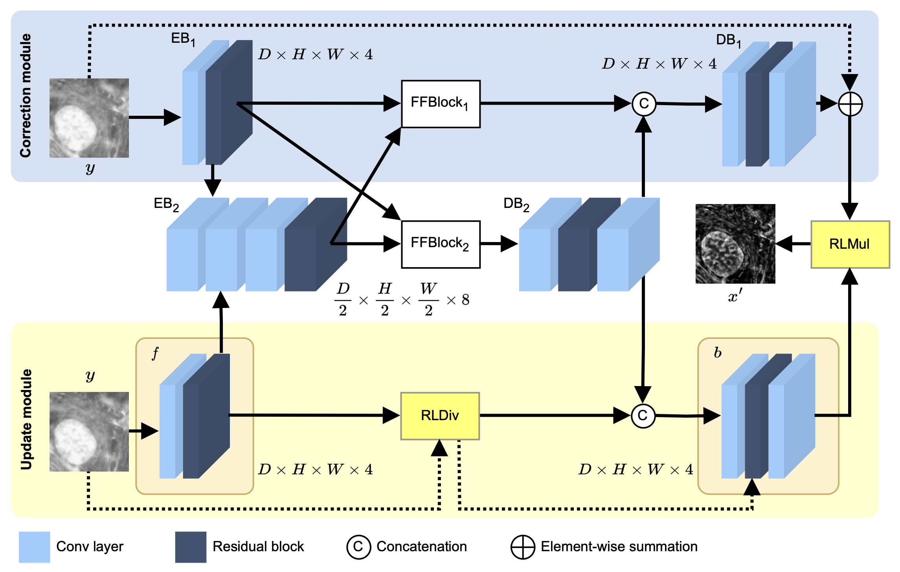

# LUCYD: A Feature-Driven Richardson-Lucy Deconvolution Network

[[pdf](https://arxiv.org/pdf/2307.07998)]

[Run in Colab 🟡▶️](https://colab.research.google.com/drive/1KG0Iv1bEcE2Hx7AYRBxk8I-mKRP5vKbw?usp=sharing)

The process of acquiring microscopic images in life sciences often results in image degradation and corruption, characterised by the presence of noise and blur, which poses significant challenges in accurately analysing and interpreting the obtained data. We propse LUCYD, a novel method for the restoration of volumetric microscopy images that combines the Richardson-Lucy deconvolution formula and the fusion of deep features obtained by a fully convolutional network. By integrating the image formation process into a feature-driven restoration model, the proposed approach aims to enhance the quality of the restored images whilst reducing computational costs and maintaining a high degree of interpretability.



Folder structure:

```
lucyd-deconvolution
│   lucyd.py
│   evaluate.py
│   train.py
│
└───utils
│   │   loader.py
│   │   ssim.py
│
└───data
│   │   gt
│   │   nuc
│   │   act
```

## Prerequisities:
* Python 3.7 or higher
* PyTorch 1.12.1 or higher
* NumPy 1.22.4
* TorchMetrics 1.0.1
* Tifffile 2023.7.10

## Training:
```
model = LUCYD(num_res=1)
model = train(model, train_dataloader, test_dataloader)
```

## Testing:
```
evaluate(model, eval_dataloader)
```

## Cite
Please cite our work if you find it useful to your research.
```
@article{chobola2023lucyd,
  title={LUCYD: A Feature-Driven Richardson-Lucy Deconvolution Network},
  author={Chobola, Tom{\'a}{\v{s}} and M{\"u}ller, Gesine and Dausmann, Veit and Theileis, Anton and Taucher, Jan and Huisken, Jan and Peng, Tingying},
  journal={arXiv preprint arXiv:2307.07998},
  year={2023}
}
```
